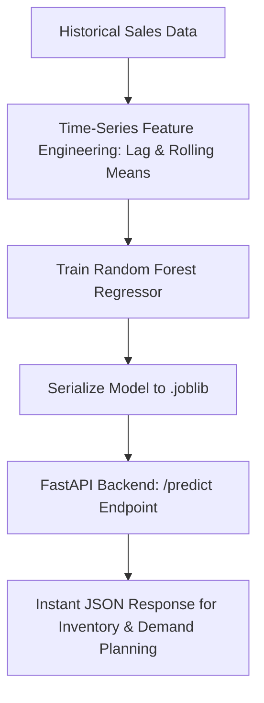

# 📈 Retail Demand Forecasting API

Welcome to the **Retail Demand Forecasting API** repository! This project demonstrates how to move machine learning models out of a static notebook environment and into a production-ready backend service using **FastAPI** and **Random Forest Regression**.

---

## 🚀 Project Architecture & Workflow



**📁 Repository Structure**
* **retail_forecasting.ipynb —** The complete lab notebook detailing data loading, feature engineering, model training, and evaluation.
* **app.py —** The FastAPI backend script that loads the trained model artifact and serves live predictions.
* **models/retail_demand_model.joblib —** The serialized machine learning model file.

## 🛠️ How to Run Locally

1. Clone the repository and navigate to the project folder.
2. Install the required dependencies:
   ```bash
   pip install fastapi uvicorn joblib pandas scikit-learn pydantic
   ```
3. Run the FastAPI server using Uvicorn:
    ```bash
     uvicorn app:app --reload
    ```
5. Test the API:
Open your browser and navigate to [http://127.0.0.1:8000/docs](http://127.0.0.1:8000/docs) to access the interactive Swagger UI and test your demand-forecasting model live!
6. Open your computer's Terminal (Mac) or Command Prompt / VS Code Terminal (Windows), make sure you are inside this project folder, and paste the commands.

**🎮 Mini Challenge for Learners:**

Can you change window=3 in Step 1 to window=6? How does it change the rolling average?

Open [http://127.0.0.1:8000/docs](http://127.0.0.1:8000/docs)[cite: 2], click on the POST /predict button, hit Try it out, and type in your own custom numbers for last month's sales to see what the AI predicts!

